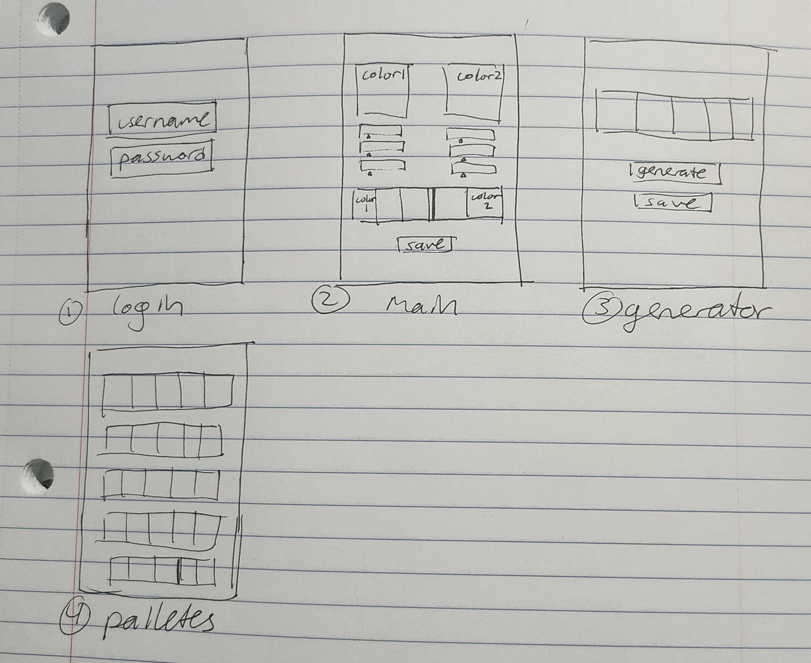

# Color Pal

[My Notes](notes.md) 
[cool site](https://roadmap.sh/)
[scratch pad](scratch.md)

Color Pal helps artists choose colors that will enhance their art and skills. It's a stepping stone for beginning artists to learn color theory in a simplified format.

## 🚀 Specification Deliverable

For this deliverable I did the following. I checked the box `[x]` and added a description for things I completed.

- [x] Proper use of Markdown
- [x] A concise and compelling elevator pitch
- [x] Description of key features
- [x] Description of how you will use each technology
- [x] One or more rough sketches of your application. Images must be embedded in this file using Markdown image references.

### Elevator pitch

As an artist who struggles with color theory, choosing the right colors for an artpiece is incredibly daunting, especially with all the possible colors one can choose from. Simplifying the process by providing an array of colors based on a few clicks from the user will help artists pick interesting and excellent color pallettes for their art. Additionally, users can generate random color palletes to find new colors they might want to work with. Users are abls to save both the palletes they make and randomly generate for ease of access. 

### Design

### Key features

- color pallete generator (using a 3rd party color generator)
- color selector (user choose 2 colors, 5 slot gradient updates)
- saved color palletes (stores all previously saved ones)
- receive notifications when users share color palletes

### Technologies

- **HTML** - structure and organize the pages (login, main, pallette, generator, social) *login page* has 2 boxes in the center for email and password to login. *main page* contains 2 square boxes whose colors are easily adjusted by the below color selectors. 5 slots depict the color scale. There is a button under the colors for saving the color pallette. The *generator page* has a bar of color (divided into 5 sections) with a save button as well. *pallette page* has bars of previously saved color scales saved by the user,, topmost pallete is most recent. button (or swipe action) shares the pallete once (pushes it out as a notification pop up for users who follow them, so they can choose to add the pallete to their saved palletes), *social page* list of people the user follows (there is an add button for adding a user's username or email), a trashcan button for unfollowing the person

- **CSS** - dark grey background probably, each slot is an inbetween gradient from the right color box and left color box. the font will probably be robboto, open sans, Pacifico, or Lato or combination of a few. The generate button and save button will probably be blue or red (make sure it's nice), rounded buttons are more pleasing to the eye. buttons will probably get darker when a user presses them. White space nice for user interaction

- **React** - current color selected updated as sliders move,the color sliders change color as a slider moves, and the box changes color too. things evenly apart, the 5 slots change as one of the box colors change. when save button pressed, it adds the current color pallete to the user's color palletes. when generate button pressed, displays a random color pallete. logging in directs user to main page of selecting colors. left arrow button on main page goes to generator page, right arrow button on main page goes to saved color palletes

- **Service** - allows users to edit saved color palletes (removing them from database, editting ones they created but not randomly generated) login page allows access to user's account and consequently their saved color palletes. create account and logout also some things to do. for the generate random color pallete, it accesses http://colormind.io/ and uses the randomly generated colors on there to make the pallete. (example code to look for below from the site)
>(<)div class="color" style="background-color: #1e262a" data-id="4" data-color="#1e262a" data-locked="false">(<)div class="swipe">(<)/div>(<)/div> 

- **DB/Login** - stores profiles (account info) and each profile's associated color palletes they saved along with database stores the list of people the user ollows.

- **WebSocket** - share pallete sends a real-time notification to all their followers, notification reads "so and so shared a new pallete! add to your collection?"

## 🚀 AWS deliverable

- [x] **Server deployed and accessible with custom domain name** - [ColorPal](https://startup.colorpal.link/).
- [x] **just in case** - [ColorPal more basic](https://colorpal.link/)

## 🚀 HTML deliverable

For this deliverable I did the following. I checked the box `[x]` and added a description for things I completed.

- [x] **HTML pages** - I created the html pages I will be using for the project, namely index(login)  generator (generate pallete) create(create pallete) palletes(saved palletes) following(friends list)
- [ ] **Proper HTML element usage** - 
- [ ] **Links** - I did not complete this part of the deliverable.
- [ ] **Text** - I did not complete this part of the deliverable.
- [ ] **3rd party API placeholder** - I did not complete this part of the deliverable.
- [ ] **Images** - I did not complete this part of the deliverable.
- [ ] **Login placeholder** - I did not complete this part of the deliverable.
- [ ] **DB data placeholder** - I did not complete this part of the deliverable.
- [ ] **WebSocket placeholder** - I did not complete this part of the deliverable.

## 🚀 CSS deliverable

For this deliverable I did the following. I checked the box `[x]` and added a description for things I completed.

- [ ] **Visually appealing colors and layout. No overflowing elements.** - I did not complete this part of the deliverable.
- [ ] **Use of a CSS framework** - I did not complete this part of the deliverable.
- [ ] **All visual elements styled using CSS** - I did not complete this part of the deliverable.
- [ ] **Responsive to window resizing using flexbox and/or grid display** - I did not complete this part of the deliverable.
- [ ] **Use of a imported font** - I did not complete this part of the deliverable.
- [ ] **Use of different types of selectors including element, class, ID, and pseudo selectors** - I did not complete this part of the deliverable.

## 🚀 React part 1: Routing deliverable

For this deliverable I did the following. I checked the box `[x]` and added a description for things I completed.

- [ ] **Bundled using Vite** - I did not complete this part of the deliverable.
- [ ] **Components** - I did not complete this part of the deliverable.
- [ ] **Router** - I did not complete this part of the deliverable.

## 🚀 React part 2: Reactivity deliverable

For this deliverable I did the following. I checked the box `[x]` and added a description for things I completed.

- [ ] **All functionality implemented or mocked out** - I did not complete this part of the deliverable.
- [ ] **Hooks** - I did not complete this part of the deliverable.

## 🚀 Service deliverable

For this deliverable I did the following. I checked the box `[x]` and added a description for things I completed.

- [ ] **Node.js/Express HTTP service** - I did not complete this part of the deliverable.
- [ ] **Static middleware for frontend** - I did not complete this part of the deliverable.
- [ ] **Calls to third party endpoints** - I did not complete this part of the deliverable.
- [ ] **Backend service endpoints** - I did not complete this part of the deliverable.
- [ ] **Frontend calls service endpoints** - I did not complete this part of the deliverable.
- [ ] **Supports registration, login, logout, and restricted endpoint** - I did not complete this part of the deliverable.

## 🚀 DB deliverable

For this deliverable I did the following. I checked the box `[x]` and added a description for things I completed.

- [ ] **Stores data in MongoDB** - I did not complete this part of the deliverable.
- [ ] **Stores credentials in MongoDB** - I did not complete this part of the deliverable.

## 🚀 WebSocket deliverable

For this deliverable I did the following. I checked the box `[x]` and added a description for things I completed.

- [ ] **Backend listens for WebSocket connection** - I did not complete this part of the deliverable.
- [ ] **Frontend makes WebSocket connection** - I did not complete this part of the deliverable.
- [ ] **Data sent over WebSocket connection** - I did not complete this part of the deliverable.
- [ ] **WebSocket data displayed** - I did not complete this part of the deliverable.
- [ ] **Application is fully functional** - I did not complete this part of the deliverable.
